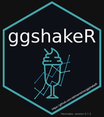

<!-- README.md is generated from README.Rmd. Please edit that file -->

```{r, include = FALSE}
knitr::opts_chunk$set(
  collapse = TRUE,
  comment = "#>",
  fig.path = "man/figures/README-",
  out.width = "100%"
)
```

# ggshakeR 

Welcome to ggshakeR!

This is R's all-inclusive package for visualization and analysis of openly available soccer data.

This package aims to provide people interested in football analysis and visualization a platform to learn about it while also learning a new language while at it. This package is designed to work with open soccer data. These data sets, for now, include:

* [FBref](https://fbref.com/en/)
* [StatsBomb Open Dataset](https://github.com/statsbomb/StatsBombR)
* [Understat](https://understat.com/)

R gets a bad rep, at times, especially compared to it's more cooler brother, Python. However, as you'll find with ggshakeR, it really isn't that bad!

Let's get you started with the package!

# Getting Started With ggshakeR

First things first, install R and RStudio. R is the actual language while RStudio is the IDE that will help you work with language in a nice way.

Here are links to download both:

* [R](https://www.r-project.org/)
* [RStudio](https://www.rstudio.com/products/rstudio/download/)

OK, now how do you get ggshakeR into RStudio? 

First install the devtools package:

```{r, eval=FALSE}
install.packages("devtools")
```

After that, write the actual code to install ggshakeR:

```{r, eval=FALSE}
devtools::install_github("abhiamishra/ggshakeR", subdir="ggshakeR")
```

Now the library is installed but it's not in your session just yet! When a package is in a session means you can actually use the package:

```{r, eval=FALSE}
library(gghshakeR)
```

And that's it you're done!

We hope you have fun!

## Helpful Links
Here are some helpful links to get you started with the package:

* [Guide To Pitch Plots](https://abhiamishra.github.io/ggshakeR/articles/Guide_to_Pitch_Plots.html)
* [Guide To Expected Threat](https://abhiamishra.github.io/ggshakeR/articles/Guide_to_Exp_Threat.html)
* [Guide To Pizza Plots](https://abhiamishra.github.io/ggshakeR/articles/Guide_to_PizzaPlots.html)

# Credit
Thank you to StatsBomb and [Ewan Henderson](https://github.com/ewenme) for their respective packages. A big thank you to Ninad Barbadikar for creating the beautiful logo and helping with the package in general. Thank you [Jase Ziv](https://github.com/JaseZiv) for your help and your package [WorldFootballR](https://github.com/JaseZiv/worldfootballR) from which this took inspiration from. 

# Contact and Support
Tell your friends about ggshakeR and shake theiR lives away! 
You can contact me at [email](abhiamishra0@gmail.com) or at my [Twitter](https://twitter.com/MishraAbhiA)

Powered by Chatalytics:tm:

Owner and Creator: __Abhishek Amol Mishra__

# Licenses Used
* [Torvaney](https://github.com/Torvaney/ggsoccer) and the ggsoccer package has been used in the package for creation of pitches. The use of this adheres to the [MIT License](https://github.com/Torvaney/ggsoccer/blob/master/LICENSE.md) provided. 

Licensing Copyright Statement:
Copyright (c) 2019 Benjamin Torvaney

Permission is hereby granted, free of charge, to any person obtaining a copy of this software and associated documentation files (the "Software"), to deal in the Software without restriction, including without limitation the rights to use, copy, modify, merge, publish, distribute, sublicense, and/or sell copies of the Software, and to permit persons to whom the Software is furnished to do so, subject to the following conditions:

The above copyright notice and this permission notice shall be included in all copies or substantial portions of the Software.

THE SOFTWARE IS PROVIDED "AS IS", WITHOUT WARRANTY OF ANY KIND, EXPRESS OR IMPLIED, INCLUDING BUT NOT LIMITED TO THE WARRANTIES OF MERCHANTABILITY, FITNESS FOR A PARTICULAR PURPOSE AND NONINFRINGEMENT. IN NO EVENT SHALL THE AUTHORS OR COPYRIGHT HOLDERS BE LIABLE FOR ANY CLAIM, DAMAGES OR OTHER LIABILITY, WHETHER IN AN ACTION OF CONTRACT, TORT OR OTHERWISE, ARISING FROM, OUT OF OR IN CONNECTION WITH THE SOFTWARE OR THE USE OR OTHER DEALINGS IN THE SOFTWARE.
