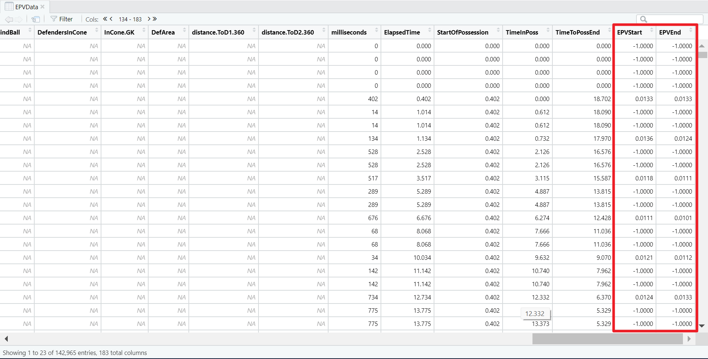

```{r, include = FALSE}
knitr::opts_chunk$set(
  collapse = TRUE,
  comment = "#>",
  eval = FALSE
)
```

Welcome to the Expected Possession Value Guide for ggshakeR!

EPV - short for Expected Possession Value - is one of the most
popular and informative metrics out there! Measuring the probability that an action leads to a goal, EPV allows you to 
objectively calculate passes, carries, and other events.

EPV was developed by [Javier Fernández, Luke Bornn & Daniel Cervone](https://link.springer.com/article/10.1007/s10994-021-05989-6).

There are various iterations of EPV that exist out there.
OptaPro has their own PV while StatsBomb has something similar with their OBV. 

The only publicly available data regarding EPV comes from Laurie Shaw who made an EPV grid public with his work with [Friends of Tracking](https://www.youtube.com/watch?v=KXSLKwADXKI&feature=emb_title)

Laurie Shaw's EPV grid is what ggshakeR uses. 

Every time you load in the package, ggshakeR will load in a dataframe called __EPVGrid__. __EPVGrid__ houses all the EPV data that Laurie Shaw made public and now it is available for you in a line of code!

Simply write:

```{r, eval=FALSE}
library(ggshakeR)

head(EPVGrid)
```


This dataframe is there for you to use and play with. The columns correspond to pitch divisions from your own goal (V1) to the opponent's goal (V50). The grid is symmetrical in half and as such, there is no "top"/"bottom" of the pitch.

However, what if you want to use EPV? Calculate it?

ggshakeR offers you the `calculate_epv()` function that calculates EPV for the data that is passed in!

Here are some characteristics:

* Needs 4 columns named as `x`, `y`, `finalX`, `finalY`.

Here's the cool thing about the `calculate_epv()` function: __It calculates the xT of the start of a pass/carry and the xT of the end of the pass/carry__.

Why is this important? Well, let's take a take-on. That only has a starting `x` ,`y` . In the dataframe, the columns of `finalX` and `finalY` have `NAs` in them. The `calculate_epv()` will give you the EPV for both the starting and ending locations allowing you to give a value to single-event values. 

This means, you can use this function beyond passes and carries and be able to calculate EPV for clearances, tackles, take-ons, etc! In addition, by separating out the EPV values for the start and end, you can apply more advanced analytics to the passes.

Let's see how we can use it!

## Using the `calculate_epv()` function

First, let's get some data! You can either import you data or use [Statsbomb's open free dataset](https://github.com/statsbomb/open-data)

In this example, I'll be using StatsBomb's [Messi Data](https://statsbomb.com/2019/12/messi-data-biography-15-seasons-now-complete-and-available/) for La Liga 2014/15:

```{r, eval=FALSE}
library(StatsBombR)

Comp <- FreeCompetitions() %>%
  filter(competition_id == 11 & season_name == "2014/2015")

Matches <- FreeMatches(Comp)

StatsBombData <- StatsBombFreeEvents(MatchesDF = Matches, Parallel = TRUE)

StatsBombData <- allclean(StatsBombData)

plottingData <- StatsBombData
```

Before plotting, I am going to rename my columns:

```{r, eval=FALSE}
plottingData <- plottingData %>%
  rename("x" = "location.x",
         "y" = "location.y",
         "finalX" = "pass.end_location.x",
         "finalY" = "pass.end_location.y")
```

For `calculate_epv()`, __always write the `type` that the data is: opta or statsbomb__. After that, we simply get:

```{r, eval=FALSE}
EPVData <- calculate_epv(plottingData, type = "statsbomb")
```

If we inspect `EPVData`, we see these two new columns at the very end:

{width=90%}

As you'll see, `calculate_epv()` will put a -1 in areas where there was a value that was not right for calculation. To calculate the difference in EPV, simply write:

```{r, eval=FALSE}
EPVData <- EPVData %>%
  mutate(EPV = EPVEnd - EPVStart)
```

This will give you the difference in EPV and this value can be used for passes, carries - anything that has a start and an end location. Use `EPVStart`/`EPVEnd` for single-occuring events such as take-ons, tackles, if you so wish.
