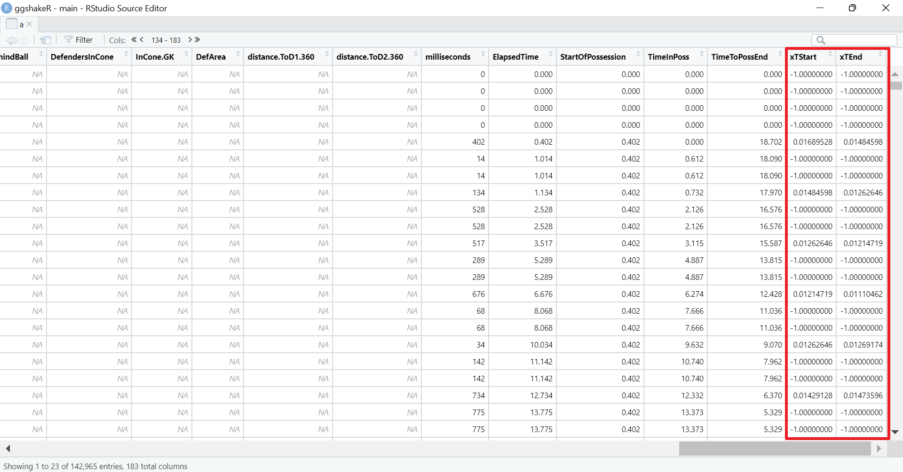

```{r, include = FALSE}
knitr::opts_chunk$set(
  collapse = TRUE,
  comment = "#>"
)
```

Welcome to the Expected Threat Guide for ggshakeR!

First things first, we are only able to do this because of the amazing work by Karun Singh. Read his excellent [xT blog post](https://karun.in/blog/expected-threat.html) that goes into in-depth explanation of the need and use of the metric. 

Karun Singh's xT grid is what ggshakeR uses. Every time you load in the package, ggshakeR will load in a dataframe called __xTGrid__. __xTGrid__ houses all the xT data that Karun Singh made public and now it is available for you in a line of code!

Simply write:

```{r}
library(ggshakeR)

head(xTGrid)
```


This dataframe is there for you to use and play with. The columns correspond to pitch divisions from your own goal (X0) to the opponent's goal (X11). The grid is symmetrical in half and as such, there is no "top"/"bottom" of the pitch.

However, what if you want to use xT? Calculate it?

ggshakeR offers you the `calculate_threat()` function that calculates xT for the data that is passed in!

Here are some characteristics:

* Needs 4 columns named as `x`, `y`, `finalX`, `finalY`.

Here's the cool thing about the `calculate_threat()` function: __It calculates the xT of the start of a pass/carry and the xT of the end of the pass/carry__.

Why is this important? Well, let's take a take-on. That only has a starting `x` ,`y` . In the dataframe, the columns of `finalX` and `finalY` have `NAs` in them. The `calculate_threat()` will give you the xT for both the starting and ending locations allowing you to give a value to single-event values - basically, it gives you the most freedom and information regarding xT.

Let's see how we can use it!

## Using the `calculate_threat()` function

First, let's get some data! You can either import you data or use [Statsbomb's open free dataset](https://github.com/statsbomb/open-data)

In this example, I'll be using StatsBomb's [Messi Data](https://statsbomb.com/2019/12/messi-data-biography-15-seasons-now-complete-and-available/) for La Liga 2014/15:

```{r, eval=FALSE}
Comp <- FreeCompetitions() %>%
  filter(competition_id == 11 & season_name == "2014/2015")

Matches <- FreeMatches(Comp)

StatsBombData <- StatsBombFreeEvents(MatchesDF = Matches, Parallel = TRUE)

StatsBombData <- allclean(StatsBombData)

plottingData <- StatsBombData
```

Before plotting, I am going to rename my columns:

```{r, eval=FALSE}
plottingData <- plottingData %>%
  rename("x" = "location.x",
         "y" = "location.y",
         "finalX" = "pass.end_location.x",
         "finalY" = "pass.end_location.y")
```

For `calculate_threat()`, __always write the dataType that the data is: opta or statsbomb__. After that, we simply get:

```{r, eval=FALSE}
xTData <- calculate_threat(plottingData, dataType = "statsbomb")
```

If we inspect `xTData`, we see these two new columns at the very end:

{width=90%}

As you'll see, `calculate_threat()` will put a -1 in areas where there was a value that was not right for calculation. To calculate the difference in xT, simply write:

```{r, eval=FALSE}
xTData <- xTData %>%
  mutate(xT = xTEnd - xTStart)
```

This will give you the difference in xT and this value can be used for passes, carries - anything that has a start and an end location. Use `xTStart`/`xTEn`d for single-occuring events such as take-ons, tackles, if you so wish.
