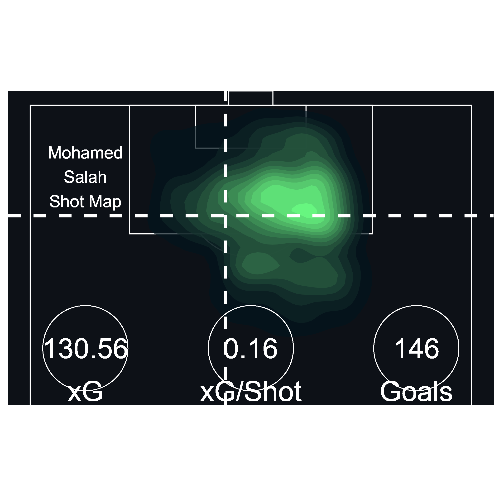

```{r, include = FALSE}
knitr::opts_chunk$set(
  collapse = TRUE,
  comment = "#>",
  eval = FALSE
)
```

This is the guide for using Pitch Plots in `ggshakeR`.

These plots aim to plot events on a pitch hence the name...Pitch Plots!

Currently, `ggshakeR` houses 7 Pitch Plots:

-   `plot_pass()`
-   `plot_heatmap()`
-   `plot_sonar()`
-   `plot_passflow()`
-   `plot_shot()`
-   `plot_convexhull()`
-   `plot_voronoi()`
-   `plot_passnet()`

Let's learn simple guides on how to use them!

# Understat

## `plot_shot()`

Characteristics:

-   Only works with [Understat](https://understat.com/) data
-   Has three types: hexbin, density, or point (default)

The easiest Pitch Plot function to use! To use this function, which *only works with Understat data*, we need the [understatr package](https://github.com/ewenme/understatr).

Once you have installed the package, put the package in your work session by writing:

```{r eval=FALSE}
library(understatr)
```

We will use the understatr package to get the data for `plot_shot()`. Browse through the understatr package to get their data. As a sanity check, make sure the dataframe has columns with these names:

-   `X` (not x)
-   `Y` (not y)
-   `xG`
-   `result`
-   `name`

Here, I am going to get Mohammed Salah's data. To learn more about how to get data, read [Nandy's excellent guide](https://sagnikdas1.medium.com/tabguide-1-making-shot-maps-1c030f08393e).

```{r, eval=FALSE}
shot_data <- get_player_shots(player_id = 1250) # Salah's `player_id` on Understat is `1250`
```

After that, simply write and execute the following code to get a beautiful shot map:

```{r, eval=FALSE}
plot <- plot_shot(data, type = "density")

plot
```

{width="80%"}

An additional feature is provided through a couple of other arguments within the function in the form of **highlight_goals** and **average_location**. Use them by toggling between *TRUE* and *FALSE*.

```{r, eval=FALSE}
plot <- plot_shot(shot_data, highlight_goals = TRUE, average_location = FALSE)
plot
```

Note that, you can write *"hexbin"*, *"density"*, and *"point"* to get three different types of shot maps. However, the **highlight_goals** parameter only works for point shot maps. Try it out!

# Opta & StatsBomb

## `plot_sonar()`, `plot_heatmap()`, `plot_pass()` & `plot_passflow()`

These three functions are quite similar in what they require.

-   `plot_sonar()` gives you a pass sonar
-   `plot_heatmap()` gives you a heat map on the pitch
-   `plot_pass()` gives you all the passes on the pitch
-   `plot_passflow()` gives you a pass flow map on the pitch

Here are some key things to know:

-   `plot_sonar()`, `plot_pass()` and `plot_passflow()` expect passing data

-   All three functions require the data to have at minimum four columns named: **x, y, finalX, finalY**

-   All three functions work on either Opta or Statsbomb data

-   All three functions need a minimum of 4 columns named:

    -   `x` (indicates starting x location)
    -   `y` (indicates starting y location)
    -   `finalX` (indicates ending x location for passes)
    -   `finalY` (indicates ending y location for passes)

Let's first get some data! You can either import you data or use [Statsbomb's open free dataset](https://github.com/statsbomb/open-data)

In this example, I'll be using StatsBomb's Messi Data for La Liga 2014/15:

```{r, eval=FALSE}
library(StatsBombR)

Comp <- FreeCompetitions() %>%
  filter(competition_id == 11 & season_name == "2014/2015")
Matches <- FreeMatches(Comp)
StatsBombData <- StatsBombFreeEvents(MatchesDF = Matches, Parallel = TRUE)
plotting_data  <- allclean(StatsBombData)
```

Before plotting, I am going to rename my columns:

```{r, eval=FALSE}
plotting_data <- plotting_data %>%
  rename("x" = "location.x",
         "y" = "location.y",
         "finalX" = "pass.end_location.x",
         "finalY" = "pass.end_location.y")
```

Sweet, let's plot!

### `plot_heatmap()`

For the heat map, we simply select our columns and plot! **Type** options include *bin*, *hex*, *density* and *jdp*. Note that we don't specify **data_type** since the default is set to "statsbomb", so we can simply write this:

```{r, eval=FALSE}
heat_data <- plotting_data %>%
  select(x, y)

heatPlot <- plot_heatmap(data = heat_data, type = "bin")

heatPlot
```

{width="80%"}

### `plot_sonar()`

For the pass sonar, we're going to a bit more data cleaning. I don't want everybody's passing sonar - that's redundant!

For our purposes, I want Jordi Alba's passing sonar. First, let me get all passes from Jordi Alba:

```{r, eval=FALSE}
plotting_data_alba  <- plotting_data %>%
  filter(type.name == "Pass" & team.name == "Barcelona" & player.name == "Jordi Alba Ramos")
```

Now I can construct a pass sonar! Default **data_type** is set to *"statsbomb"*, so here we can simply write:

```{r, eval=FALSE}
sonarPlot <- plot_sonar(data = plotting_data_alba)

sonarPlot
```

{width="80%"}

### `plot_pass()`

We can create a pass map of all of Jordi Alba's passes during a particular match by using the `plot_pass()` function. 

```{r, eval=FALSE}
plotting_data_alba_single <- plotting_data_alba %>%
  filter(match_id == 70264)

passPlot <- plot_pass(data = plotting_data_alba_single, 
                      progressive_pass = TRUE, type = "all")
passPlot
```

{width="80%"}

### `plot_passflow()`

Since we already have Jordi Alba's passes, we can just construct the pass flow like this:

```{r, eval=FALSE}
passflowPlot <- plot_passflow(data = plotting_data_alba)

passflowPlot
```

{width="80%"}

## `plot_convexhull()`

This function allows the user to use event data to plot the convex hulls of multiple or a single player. It works on both Opta and StatsBomb data and requires the following columns:

-   `x`
-   `y`
-   `finalX`
-   `finalY`
-   `playerId` (Player name's)

Let us plot using the data set we already have.

```{r, eval=FALSE}
unique(plotting_data$match_id) # Find all match ID's from the data set

convexPlot <- plotting_data %>%
  filter(match_id == 266631,
         team.name == "Barcelona") %>%
  plot_convexhull()

convexPlot
```

{width="80%"}

Note that we do not need to pass any parameters to the function here as the data set has already been specified and the default **data_type** is set to *"statsbomb"*. If using Opta data, set the **data_type** as such. Manipulate the data set as per your needs and use-case. You can also plot a single player convex hull by filtering for the specific name in the pipe before applying the function. You can also alter the title and colors as you wish by using the relevant parameters. 

Here is an example:

```{r, eval=FALSE}
convexPlot <- plotting_data %>%
  filter(match_id == 266631,
         player.name == "Jordi Alba Ramos") %>%
  plot_convexhull(color = "#41ab5d", title = "Jordi Alba Convex Hull")

convexPlot
```

{width="80%"}

## `plot_voronoi()`

This function allows the user to use event data to plot the voronoi plot of a set of points.
It works on both Opta and StatsBomb data and requires the following columns:

-   `x`
-   `y`

Let us plot using the data set we already have. First, we'll get a summarized
data set of players and their mean positions.

```{r, eval=FALSE}
finalData <- plotting_data %>%
  filter(team.name == "Barcelona") %>%
  group_by(player.name) %>%
  summarise_at(vars(x, y, minute), list(name = mean), na.rm = TRUE) %>%
  na.omit() %>%
  rename("x" = "x_name") %>%
  rename("y" = "y_name")
```

After that, we can simply use the voronoi plot function:

```{r, eval=FALSE}
plotVoronoi <- plot_voronoi(finalData)
plotVoronoi
```

{width="80%"}

A note to remember, the voronoi plot works *best* when you have a summarized
set of points. 

For example, to see something like all of the start locations of
a player's passes, you would use convexhull() while to see how the team's mean
position for each player, you would use voronoi()

Note that we do not need to pass any parameters to the function here as the data set has already been specified and the default **data_type** is set to *"statsbomb"*. If using Opta data, set the **data_type** as such. 

Manipulate the data set as per your needs and use-case. You can also fill the
voronoi plots based on the values. You will need the fill value as another column.
As usual, you can use piping to apply the function directly all in one line.

As an example, we will show EPV values calculated through `calculate_epv()`.

```{r, eval=FALSE}
threatData <- calculate_epv(plotting_data)
```

Once we have that, we will repeat the same code as before with a small change:

```{r, eval=FALSE}
finalData <- threatData %>%
  filter(team.name == "Barcelona") %>%
  group_by(player.name) %>%
  filter(EPVStart != -1) %>% #Getting rid of -1 as that as how we identify null values
  #We get the mean and sum of these three columns
  summarise_at(vars(x, y, EPVStart), list(name = mean, sum), na.rm = TRUE) %>%
  na.omit() %>%
  rename("x" = "x_name") %>%
  rename("y" = "y_name") %>%
  rename("EPV_Start" =  "EPVStart_fn1") #Renaming the relevant columns

#Plot voronoi plot

plotVoronoi <- plot_voronoi(data = finalData, 
                            fill = "EPV_Start", 
                            title = "Barcelona Voronoi Diagram")
plotVoronoi
```

{width="80%"}

## `plot_passnet()`

This function allows users to plot pass networks of a team in a particular match using event data from StatsBomb and Opta. Here we will be demonstrating how to use this function with both data types.

### StatsBomb

Plotting a pass network with StatsBomb data is pretty simple. All you need is a standard StatsBomb data set with the 4 coordinate columns being renamed to `x`, `y`, `finalX` and `finalY`, in line with what we have done for all other functions so far. We select a specific match and then plot away!

```{r, eval=FALSE}
unique(plotting_data$match_id) # Find all match ID's from the data set

passnetPlot <- plotting_data %>%
  filter(match_id == 266631) %>%
  plot_passnet(team_name = "Barcelona")

passnetPlot
```

{width="80%"}

**team_name** is the one parameter that needs to be used here, as the all other parameters have been set to their default. Work with different colors using the **scale_color** parameter, different stats using **scale_stat**, flip the plot's orientation using **flip** and alter the subtitle with **subtitle** if you wish to do so!

### Opta

Using `plot_passnet()` with Opta data is a bit more complicated. But fear not! We will be guiding you through the entire process so that you get the hang of it. Firstly you need an Opta data set. We created a data set to perfectly mimic an Opta data set and it is available within the package for your use. Call it by running:

```{r, eval=FALSE}
optadata <- ggshakeR::SampleEventData
```

Now that you have your data set, let us see which columns we require for our function:

-   `x`
-   `y`
-   `finalX`
-   `finalY`
-   `minute`
-   `playerId` (Player name's)
-   `teamId` (Team name's)
-   `outcome` (Outcome of the pass)
-   `type` (Type of event)

Note that the *playerId* and *teamId* columns need to contain player and team **names**. The data set in our hands only contains their relevant Id's. Let us fix that and transform the data set into one that will be accepted by our function.

```{r, eval=FALSE}
optadata <- optadata %>%
  mutate(teamId = case_when(teamId == 2151 ~ "Team 1",
                            teamId == 3070 ~ "Team 2")) %>%
  mutate(playerId = case_when(playerId == "1" ~ "Cameron",
                              playerId == "2" ~ "Sahaj",
                              playerId == "3" ~ "Trevor",
                              playerId == "4" ~ "Jolene",
                              playerId == "5" ~ "David",
                              playerId == "6" ~ "Marcus",
                              playerId == "7" ~ "Ryo",
                              playerId == "8" ~ "Anthony",
                              playerId == "9" ~ "Aabid",
                              playerId == "10" ~ "Kylian",
                              playerId == "11" ~ "Harry",
                              playerId == "12" ~ "Victor",
                              playerId == "13" ~ "Jesse",
                              playerId == "14" ~ "Borges",
                              playerId == "15" ~ "Miguel",
                              playerId == "16" ~ "Alex",
                              playerId == "17" ~ "Abdul",
                              playerId == "18" ~ "Eric",
                              playerId == "19" ~ "Marten",
                              playerId == "20" ~ "Robert",
                              playerId == "21" ~ "Lionel",
                              playerId == "22" ~ "Dean",
                              playerId == "23" ~ "Aaron ",
                              playerId == "24" ~ "Benjamin",
                              playerId == "25" ~ "Diego",
                              playerId == "26" ~ "Abhishek",
                              playerId == "27" ~ "Samuel",
                              playerId == "28" ~ "Edward",
                              playerId == "29" ~ "Malik",
                              playerId == "30" ~ "Albert",
                              playerId == "31" ~ "Paul",
                              playerId == "32" ~ "Smith",
                              playerId == "33" ~ "Seth",
                              playerId == "34" ~ "Mohammed",
                              playerId == "35" ~ "Eder",
                              playerId == "36" ~ "Adam",
                              playerId == "37" ~ "Harsh",
                              playerId == "38" ~ "Jorge",
                              playerId == "39" ~ "Zak",
                              playerId == "40" ~ "Brandon"))
```

Here we have used the `case_when()` function to link the player and team Id's to the relevant names. There is still some work left to do.

```{r, eval=FALSE}
optadata <- optadata %>%
  rename(finalX = endX,
         finalY = endY)
```

We have cleaned up our data set. It is now ready to be used in the function.

**It is important to note that these steps might not be necessary for all data sets. This is only to make sure that we are following the correct format for the function. A data set with these exact column names and column type specifications will work within the function without any errors.**

Let us now plot. 

```{r, eval=FALSE}
passnetPlot <- plot_passnet(data = optadata, data_type = "opta", 
                            team_name = "Team 1", scale_stat = "EPV", 
                            scale_color = "#fec44f", flip = TRUE)

passnetPlot
```

{width="80%"}

# Contributors

There are a few people to credit with helping in the creation of the pitch plot functions.

The design for `plot_sonar()` is inspired by the pass compass plot designed by [e.](https://twitter.com/barcanumbers) Part of the sonar production code is also credited to [Eliot McKinley](https://twitter.com/etmckinley).

Credit to [Joe Gallagher](https://twitter.com/joedgallagher) and his excellent package [soccermatics](https://github.com/JoGall/soccermatics) for the code used for data wrangling in the `plot_passnet()` function.