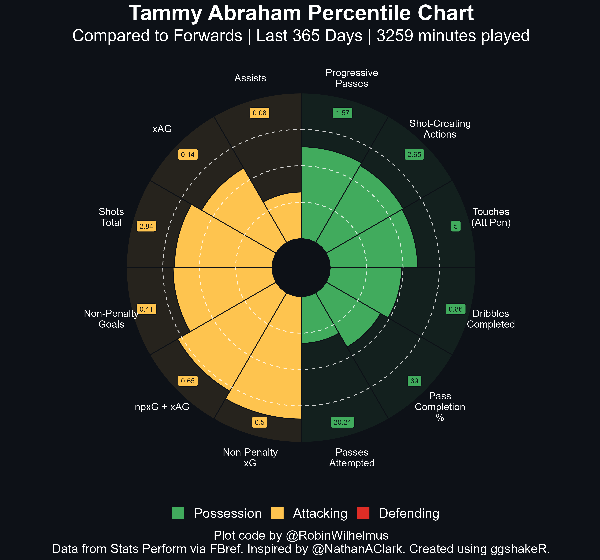

```{r, include = FALSE}
knitr::opts_chunk$set(
  collapse = TRUE,
  comment = "#>",
  eval = FALSE
)
```

# Introduction 

`plot_pizza()` is the function that allows users to plot **percentile plots** (popularly called pizza plots due to their appearance) with minimal lines of code. The function allows for plotting both **single** and **comparison** player plots, the usage of which is outlined below.

The data for the function can be scraped from the [worldfootballR](https://jaseziv.github.io/worldfootballR/) library.

## Single Player Plot

The code required to plot a single player plot using `plot_pizza()` is:

```{r, eval=FALSE}
library(worldfootballR)

single_player <- fb_player_scouting_report("https://fbref.com/en/players/f586779e/Tammy-Abraham", pos_versus = "primary")

pizza <- plot_pizza(data = single_player, type = "single", template = "outfielder", 
                    color_possession = "#41ab5d", color_attack = "#fec44f", color_defense = "#de2d26", 
                    season = "Last 365 Days", theme = "dark")

pizza
```

{width=80%}

There are 3 different templates to choose from, which are *outfielder*, *goalkeeper* and *custom*. They select specific stats that (subjectively, in the author's opinion) reflect the important attributes required for each position. Users have the option to select their own stats using the *custom* template as well. You can filter for the season required and select the colors for each stat subgroup according to your liking.

For the season filter, please look at the data scraped from FBRef and look at the "term" in scouting period. The term there will determine what season you will be filtering for when you put it in the function.

There are three color theme's for the background, namely *dark*, *black* and *white*.

### Custom Stats - Single Player

Users can use custom stats within `plot_pizza` as well. 

First, we'll add an index column to help us.
```{r, eval=FALSE}
single_player$index <- 1:nrow(single_player) ## use this column for reference in stat selection
```

Here, when you look at the index column, you'll see the numbers correspond to the statistics. Choose those numbers as shown below to select the specific stats!
```{r, eval=FALSE}
single_player <- single_player[c(1,2,3,4,5,6,7,8,9,10,11,12), ]

pizza <- plot_pizza(data = single_player, type = "single", template = "custom", 
                    color_possession = "#41ab5d", color_attack = "#fec44f", season = "Last 365 Days", 
                    color_defense = "#de2d26", theme = "dark")

pizza
```

{width=80%}

## Comparison Plot

The comparison graph can be plotted as shown below.  

```{r, eval=FALSE}
data1 <- fb_player_scouting_report("https://fbref.com/en/players/f586779e/Tammy-Abraham", pos_versus = "primary")
data2 <- fb_player_scouting_report("https://fbref.com/en/players/59e6e5bf/Dominic-Calvert-Lewin", pos_versus = "primary")

data <- rbind(data1, data2)

comp_pizza <- plot_pizza(data = data, type = "comparison", template = "outfielder",
                         player_1 = "Tammy Abraham", player_2 = "Dominic Calvert-Lewin", 
                         season_player_1 = "Last 365 Days", 
                         season_player_2 = "Last 365 Days",
                         color_compare = "#41ab5d", theme = "black")
comp_pizza
```

{width=80%}

There are 3 different templates to choose from, which are *outfielder*, *goalkeeper* and *custom*. They select specific stats that (subjectively, in the author's opinion) reflect the important attributes requires for each position. Users also have the option to select their own stats using the *custom* template as well. 

The seasons and names of both players have to be specified within the function in their respective parameters. 

There are three color themes for the background, namely *dark*, *black* and *white*.

**An important thing to note with player name's is the their entire name's have to specified.** 
**Special care must be taken to remove any accents from the name of the player.** 
**For example, *Dušan Vlahović* should be inputted as *Dusan Vlahovic*.**

### Custom Stats - Comparison Plot

For using your own stat selections with comparison plots, the following format is to be used.

Just like when we did custom stats for single plots, we make an index column first.
```{r, eval=FALSE}
data1 <- fb_player_scouting_report("https://fbref.com/en/players/f586779e/Tammy-Abraham", pos_versus = "primary")
data2 <- fb_player_scouting_report("https://fbref.com/en/players/59e6e5bf/Dominic-Calvert-Lewin", pos_versus = "primary")

data1$index <- 1:nrow(data1) ## reference for stats selection
data2$index <- 1:nrow(data2) ## reference for stats selection
```

After that, we select the numbers that reflect the stats and plot away!
```{r, eval=FALSE}
data1 <- data1[c(1,2,3,4,5,6,7,8,9,10,11,12), ]
data2 <- data2[c(1,2,3,4,5,6,7,8,9,10,11,12), ]

data <- rbind(data1, data2)

comp_pizza <- plot_pizza(data = data, type = "comparison", template = "custom",
                         player_1 = "Tammy Abraham", player_2 = "Dominic Calvert-Lewin", 
                         season_player_1 = "Last 365 Days", 
                         season_player_2 = "Last 365 Days",
                         color_compare = "#41ab5d", theme = "black")
comp_pizza
```

{width=80%}

## Save

You might notice that the output of the ggplot2 plot appears to be warped. 
To save these plots without this issue, the following code is to be run.

```{r, eval=FALSE}
# install.packages("ggplot2")
library(ggplot2)
#' The "bg" parameter is to be set w.r.t the theme of the plot.
#' "dark" = "#0d1117"
#' "black" = "black"
#' "white" = "white"
ggsave("image.png", bg = "black", width = 3000, height = 2800, units = "px") 
```

## Adding Player Image 

In this section, we shall detail the process of adding an image of the player to the centre of the pizza plot. This can be done via the `magick` package. 

For this, you have to first save the original pizza plot as a PNG and save a PNG image of the player in question from the internet. 
Make sure that both the plot and image are in the same working directory (file). 

Follow the steps detailed below.

```{r, eval=FALSE}
# install.packages("magick")
library(magick)

# This is a custom function. There is no need to change the code within the function. Simply run it and then use it as you would any other R function.

add_image_centre <- function(plot_path, image_path) {
  
  ## Read in plot
  fig <- image_read(plot_path)
  fig <- image_resize(fig, "1000x1000")
  
  ## Read in image
  img <- image_read(image_path)
  img <- image_scale(img, "62x85")
  
  ## Overlay
  image_composite(fig, img, offset = "+471+417")
}

# Here you use the function to add the player picture to the plot image.

imagepl <- add_image_centre(plot_path = "pizza_plot.png", image_path = "tammypic.png")
imagepl

# Save it as such

image_write(imagepl, "addimage.png")
```

{width=80%}

## Contributors

A big thanks to [Robin Wilhelmus](https://twitter.com/RobinWilhelmus) for the tutorial that helped create the plots in the function. 
Thanks to [Ham](https://twitter.com/DyslexicDdue) for inspiring the design for the comparison pizza plots with the excellent Football Slices project.