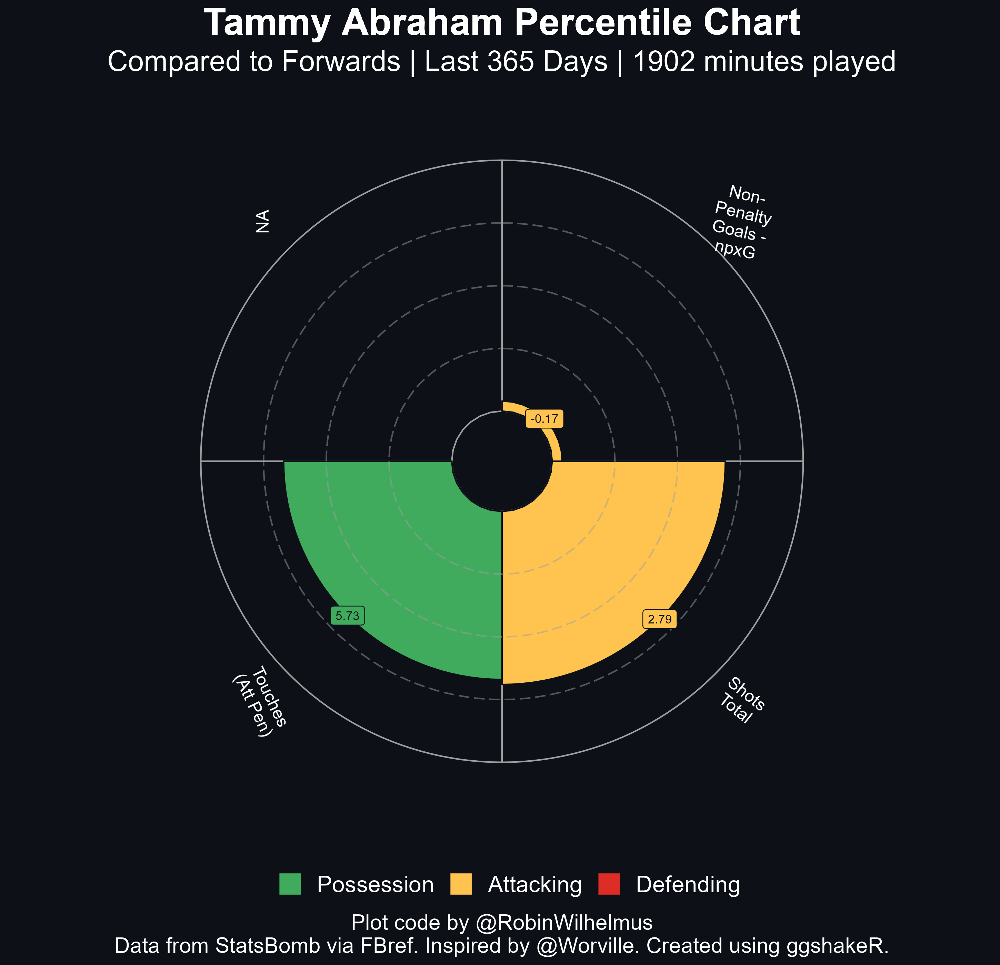

```{r, include = FALSE}
knitr::opts_chunk$set(
  collapse = TRUE,
  comment = "#>"
)
```

# Introduction 

`plot_pizza()` is the function that allows users to plot **percentile plots** (popularly called pizza plots due to their appearance) with minimal lines of code. The function allows for plotting both **single** and **comparison** player plots, the usage of which is outlined below.

The data for the function can be scraped from the [worldfootballR](https://jaseziv.github.io/worldfootballR/) library.

## Single Player Plot

The code required to plot a single player plot using `plot_pizza()` is:

```{r, eval=FALSE}
library(worldfootballR)

single_player <- fb_player_scouting_report("https://fbref.com/en/players/f586779e/Tammy-Abraham", pos_versus = "primary")

pizza <- plot_pizza(data = single_player, type = "single", template = "forward", 
                    colour_poss = "#41ab5d", colour_att = "#fec44f", season = "Last 365 Days", 
                    colour_def = "#de2d26", theme = "dark")
pizza
```

{width=80%}

There are 7 different templates to choose from, which are *forward*, *midfielder*, *winger*, *defender*, *full back*, *goalkeeper* and *custom*. They select specific stats that (subjectively, in the author's opinion) reflect the important attributes required for each position. Users have the option to select their own stats using the *custom* template as well. You can filter for the season required and select the colours for each stat subgroup according to your liking.

For the season filter, please look at the data scraped from FBRef and look at the "term" in scouting period. The term there will determine what season you will be filtering for when you put it in the function.

There are three colour theme's for the background, namely *dark*, *black* and *white*.

### Custom Stats - Single Player

Users can use custom stats within `plot_pizza` as well. 

```{r, eval=FALSE}
single_player$index <- 1:nrow(single_player) ## use this column for reference in stat selection

single_player <- single_player[c(3, 8, 13, 24, 42, 128, 45, 115, 133, 107, 101, 102, 26, 147),]

pizza <- plot_pizza(data = single_player, type = "single", template = "forward", 
                    colour_poss = "#41ab5d", colour_att = "#fec44f", season = "Last 365 Days", 
                    colour_def = "#de2d26", theme = "dark")
pizza
```

{width=80%}

## Comparison Plot

The comparison graph can be plotted as shown below.  

```{r, eval=FALSE}
data1 <- fb_player_scouting_report("https://fbref.com/en/players/f586779e/Tammy-Abraham", pos_versus = "primary")

data2 <- fb_player_scouting_report("https://fbref.com/en/players/59e6e5bf/Dominic-Calvert-Lewin", pos_versus = "primary")

data <- rbind(data1, data2)

comp_pizza <- plot_pizza(data = data, type = "comparison", template = "forward",
                         player_1 = "Tammy Abraham", player_2 = "Dominic Calvert-Lewin", 
                         season_player_1 = "Last 365 Days", season_player_2 = "Last 365 Days",
                         colour_compare = "#41ab5d", theme = "black")
comp_pizza
```

{width=80%}

There are 7 different templates to choose from, which are *forward*, *midfielder*, *winger*, *defender*, *full back*, *goalkeeper* and *custom*. They select specific stats that (subjectively, in the author's opinion) reflect the important attributes requires for each position. Users also have the option to select their own stats using the *custom* template as well. 

The seasons and names of both players have to be specified within the function in their respective parameters. 

There are three colour themes for the background, namely *dark*, *black* and *white*.

**An important thing to note with player name's is the their entire name's have to specified.** 
**Special care must be taken to remove any accents from the name of the player.** 
**For example, *Dušan Vlahović* should be inputted as *Dusan Vlahovic*.**

### Custom Stats - Comparison Plot

For using your own stat selections with comparison plots, the following format is to be used.

```{r, eval=FALSE}
data1 <- fb_player_scouting_report("https://fbref.com/en/players/f586779e/Tammy-Abraham", pos_versus = "primary")
data2 <- fb_player_scouting_report("https://fbref.com/en/players/59e6e5bf/Dominic-Calvert-Lewin", pos_versus = "primary")

data1$index <- 1:nrow(data1) ## reference
data2$index <- 1:nrow(data2) ## reference

data1 <- data1[c(3, 8, 13, 24, 42, 128, 45, 115, 133, 107, 101, 102, 26, 147),]
data2 <- data2[c(3, 8, 13, 24, 42, 128, 45, 115, 133, 107, 101, 102, 26, 147),]

data <- rbind(data1, data2)

comp_pizza <- plot_pizza(data = data, type = "comparison", template = "forward",
                         player_1 = "Tammy Abraham", player_2 = "Dominic Calvert-Lewin", 
                         season_player_1 = "Last 365 Days", season_player_2 = "Last 365 Days",
                         colour_compare = "#41ab5d", theme = "black")
comp_pizza
```

{width=80%}

## Contributors

A big thanks to [Robin Wilhelmus](https://twitter.com/RobinWilhelmus) for the tutorial that helped create the plots in the function. 
Thanks to [Ham](https://twitter.com/DyslexicDdue) for inspiring the design for the comparison pizza plots with the excellent Football Slices project.
